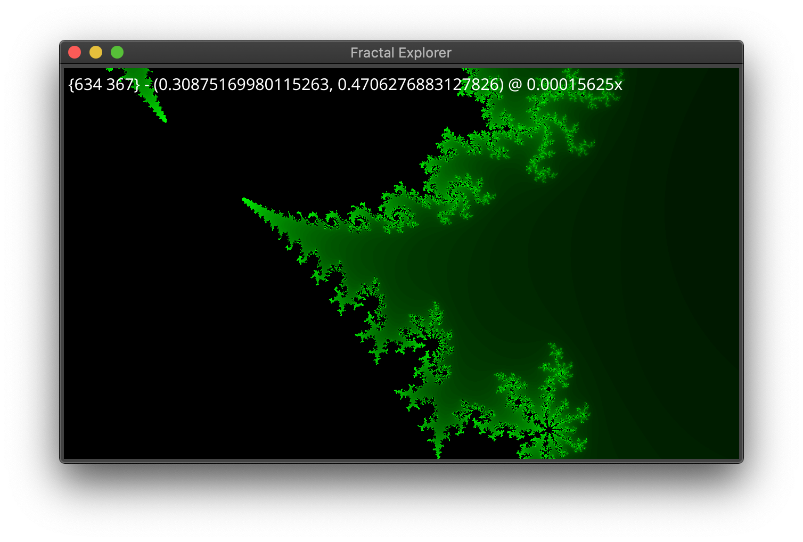

# fractal-explorer 

Small desktop application for exploring the Mandelbrot set.

## Controls

Arrow keys to pan, W/S to zoom in and out.

Click anywhere in the canvas to (roughly!) centre the viewport on that location.
